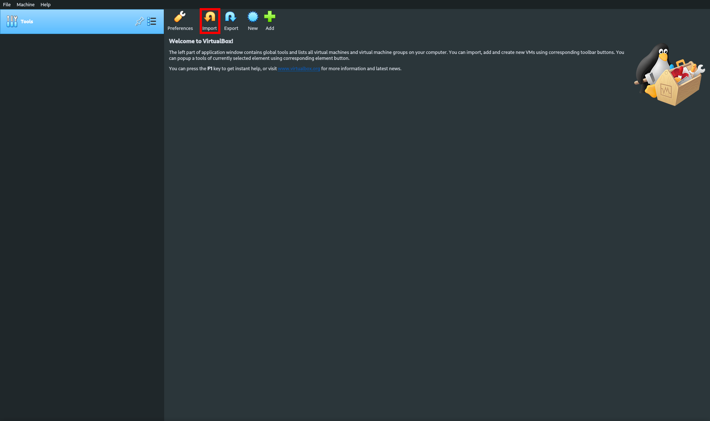
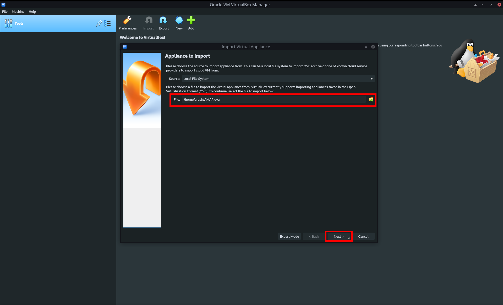
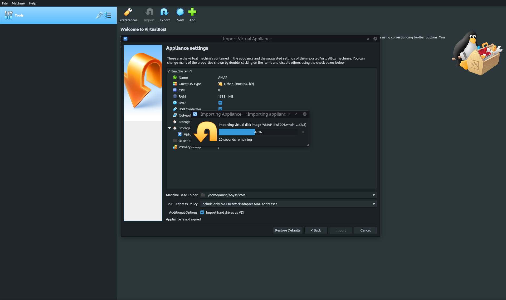
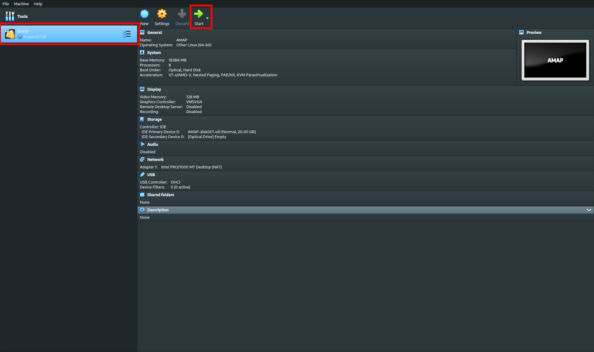
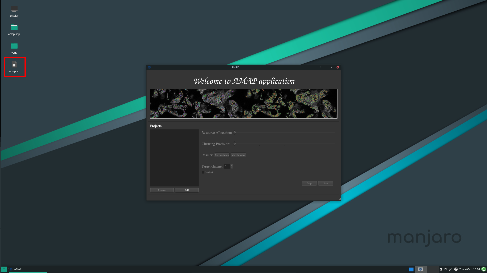
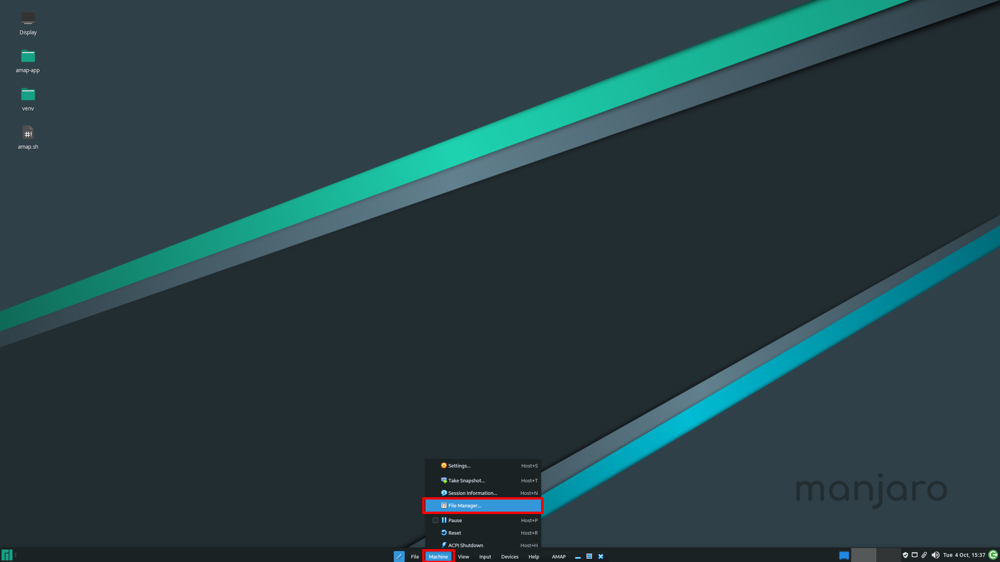
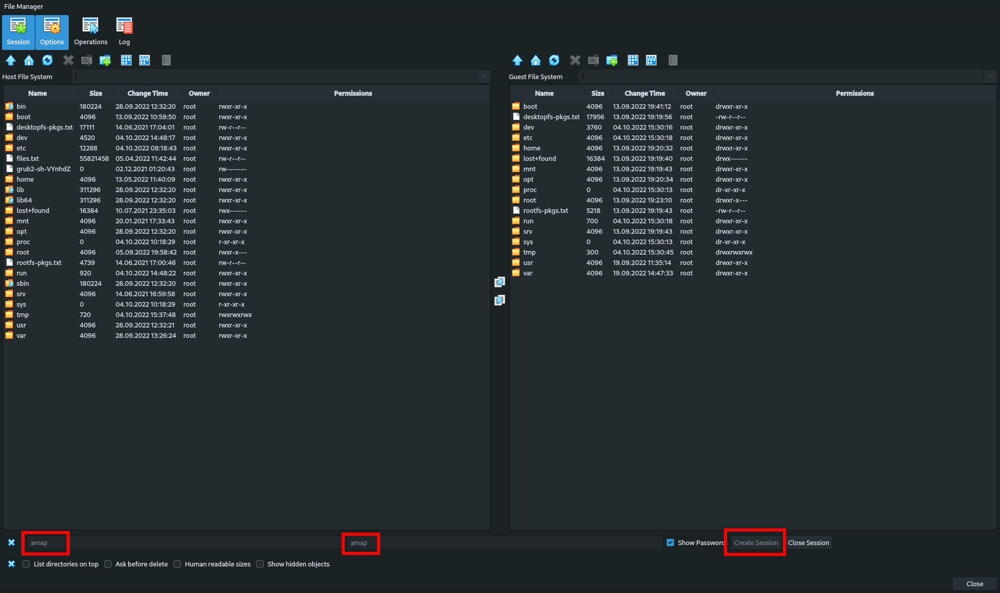

# AMAP Application

AMAP is a desktop application that performs [segmentation and morphometry quantification of fluorescent microscopy images of podocytes](https://www.biorxiv.org/content/10.1101/2021.06.14.448284v3) on the CPU. Therefore, users don't need GPUs to use the application.


This application is developed based on [AMAP](https://github.com/bozeklab/amap) repository.

### Requirements

AMAP is implemented in Python 3 and tested in Linux using Python 3.7 and 3.10. A full list of required packages is available in [requirements.txt](./requirements.txt), but to name major dependencies:

* AMAP uses [Pyside6](https://pypi.org/project/PySide6/) for its user interface which is a Python wrapper for the Qt framework.
* [Pytorch](https://pytorch.org/) is used for training and inference of deep learning models.
* [tifffile](https://pypi.org/project/tifffile/) is used to read data samples in tiff format
* [scikit-learn](https://scikit-learn.org/stable/), [OpenCV](https://pypi.org/project/opencv-python/), and [NumPy](https://numpy.org/) are used for various image processing and machine learning tasks.
* [BICO](https://ls2-www.cs.tu-dortmund.de/grav/en/bico) is a fast and efficient kmeans algorithm implemented in C++ used for clustering. It is used as a [separate executable](.res/bico/) and is called by AMAP application.

### Installation

AMAP application targeted to support Linux, macOS, and Windows. But platform-dependent implementation of the multi-processing module in Python hinders achieving that goal. For the time being, it is recommended to use the provided virtual machine(VM) to use the application. All the dependencies are installed in the VM and the application is ready to use.

Some virtualization software is needed to use the VM. The import steps are shown below for VirtualBox. Therefore, please install Virtual Box before proceeding. If you are using other virtualization software, the ova image can easily be imported into other virtualization solutions as well.

#### Import the ova image into virtual box


Open virtual box and click on import, insert the the ova file path and click on next.



Wait for the import to be finished.



#### Starting the virtual machine



Select the AMAP VM, and then click on start.
Both the username and the password are "amap".



Open the AMAP app by clicking on amap.sh on the desktop.

### Update

To update AMAP to the latest version:
* Open a terminal in the amap-app directory


* Run the command: 
```bash
git pull
```

### File Transfer: Host & VM

* Open th file transfer window, the button location might differ in different platforms.



* Enter "amap" for both username and password, and then click on "Create Session"  button



Now you can transfer files between host and the VM, Alternatively you can use ant cload solution to download the files into the VM.

### Using AMAP

AMAP application processes images in batches in the form of projects. A project is a batch of images combined with certain configurations. All images in a project must have the same order of dimensionality. At the current state AMAP only supports tiff files, therefore to create a project:
* Click on the "Add Project" button
* Select the directory containing the tiff files
* Configure the project
	* Resource Allocation: Determines how much of your computer resources will be allocated to the processing. The project finishes faster, but you might not be able to use your computer for other tasks if you choose high values.
	* Clustering Precision: AMAP uses scikit learn implementation of silhouette score for choosing the best number of clusters, which is very CPU intensitive. Reducing the sample size while calculating the silhouette score, accelerates the process by an order of magnitude without having serious effects on the results. Choosing high values will result in long processing times.
	* Target Channel: AMAP tries to automatically detect the target channel in the input images. Change this value when the automatic detection is wrong. 	
	* Stacked Checkbox: Determines whether the input images are an array of stacked or not. If they are, AMAP will use a max projection of all stacks. Change this value in the case of wrong detection.
* Click on the "Start" button and wait for the processing to be finished
* Open Segmentation and Morphometry directories to use the related buttons
