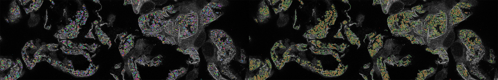
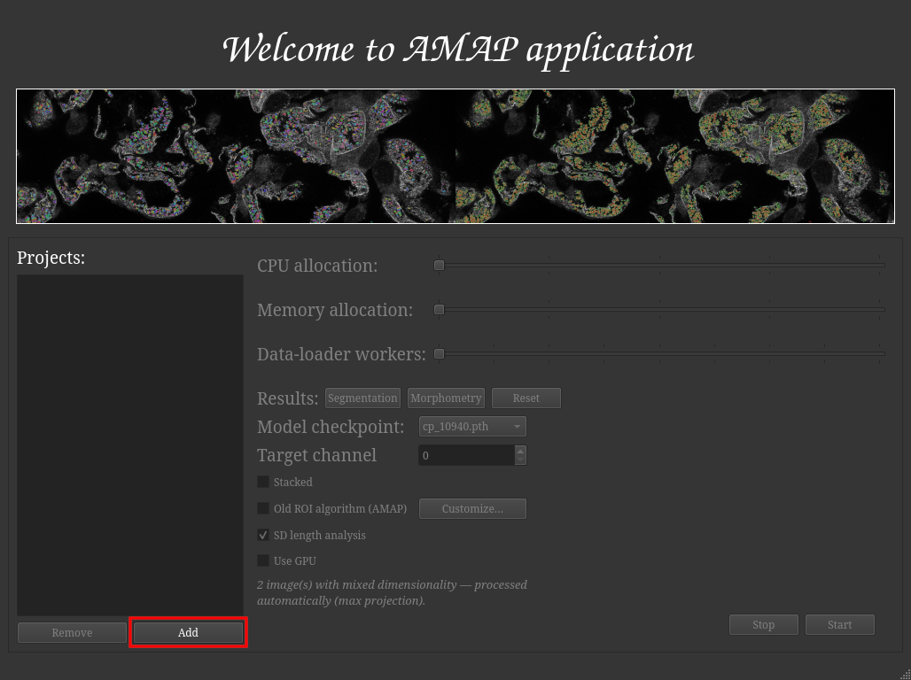
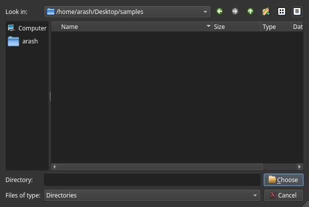
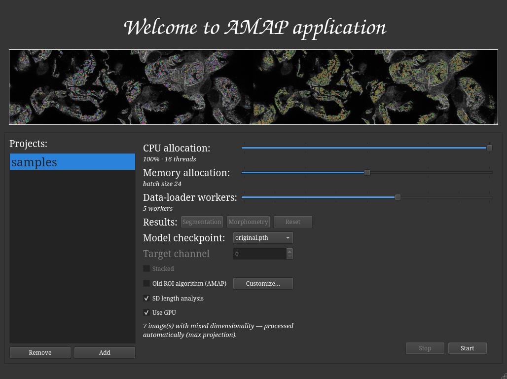
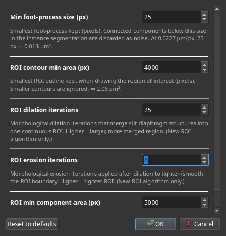
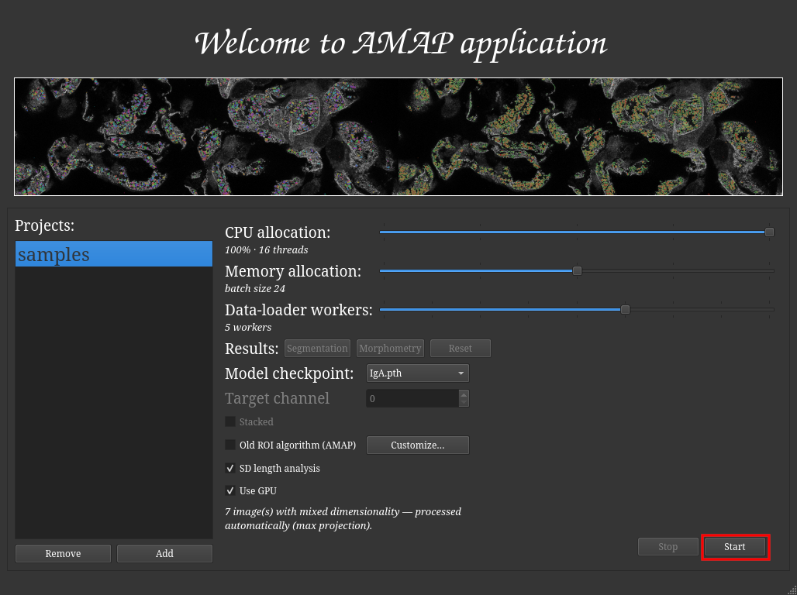
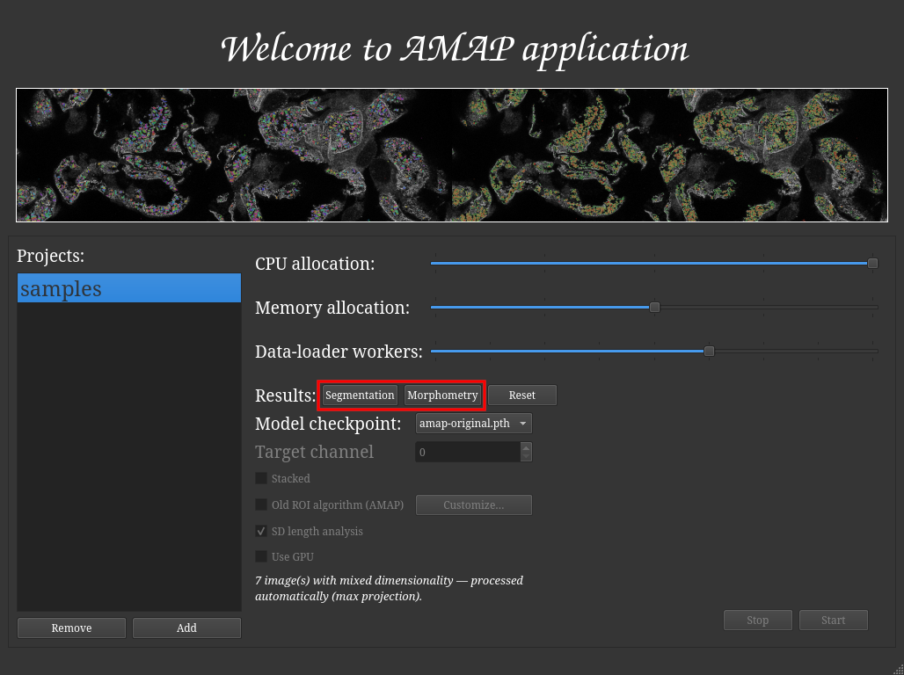

# AMAP Application

AMAP-APP is a desktop application that uses deep learning to perform [segmentation and morphometry quantification of fluorescent microscopy images of podocytes](https://www.kidney-international.org/article/S0085-2538(23)00180-1/fulltext). It runs comfortably on the CPU; a GPU is **optional** and, when available, can accelerate inference.


<!-- IMAGE: top banner / hero image. Existing file res/images/header.png is reused. Replace if you want an updated banner. -->

This application is a reimplementation of the [original research](https://github.com/bozeklab/amap) with modifications to the instance-segmentation algorithm aimed at improving compute efficiency. Instead of the original pixel-embedding clustering, AMAP-APP derives instances with PyTorch operations and a Connected Component Labeling (CCL) algorithm, achieving comparable results.

AMAP-APP is cross-platform, implemented in Python 3.9, and primarily tested on Linux (with lighter testing on Windows and Mac). Minor visual inconsistencies may appear between platforms but do not affect functionality.

## Requirements

#### Software
The full list is in [requirements.txt](./requirements.txt); the major dependencies are:

* [PySide6](https://pypi.org/project/PySide6/) — Qt bindings for the user interface.
* [PyTorch](https://pytorch.org/) — model inference (and training).
* [tifffile](https://pypi.org/project/tifffile/) — reading TIFF inputs.
* [OpenCV](https://pypi.org/project/opencv-python/), [NumPy](https://numpy.org/), [scikit-image](https://scikit-image.org/), [SciPy](https://scipy.org/) and [Pillow](https://pypi.org/project/Pillow/) — image processing, morphometry and result visualizations.
* [pandas](https://pandas.pydata.org/) — assembling the morphometry result tables.
* [psutil](https://pypi.org/project/psutil/) — detecting CPU/RAM to drive the resource sliders.

#### Hardware

* **Minimum:** 8 GB RAM, 4 CPU cores.
* **Recommended:** 16 GB RAM, 8 CPU cores.
* **Optional:** a CUDA-capable NVIDIA GPU. Inference uses it automatically when *Use GPU* is enabled and a compatible GPU is detected; otherwise AMAP-APP runs on the CPU.

## Installation

1. Make sure the following are installed:
    * git
    * Python 3.9

2. Clone the repository
```bash
git clone https://github.com/bozeklab/amap-app.git
```

3. Prepare the Python environment

Go into the **amap-app** directory:

```bash
cd amap-app
```

Create a virtual environment:

```bash
python -m venv venv
```

Activate the virtual environment:

* On Linux/Mac

```bash
source ./venv/bin/activate
```

* On Windows

```powershell
Set-ExecutionPolicy Unrestricted -Scope Process
.\venv\Scripts\Activate
```

Install the requirements:

* On Linux/Mac

```bash
pip install -r requirements.txt
```

* On Windows

```powershell
pip install -r requirements-win.txt
```

## Update

To update AMAP to the latest version, open a terminal in the amap-app directory and run:

```bash
git pull
```

## Running AMAP-APP

Activate the virtual environment first, from the repository's directory:

* On Linux/Mac

```bash
source ./venv/bin/activate
```

* On Windows

```powershell
Set-ExecutionPolicy Unrestricted -Scope Process
.\venv\Scripts\Activate
```

Then launch the application:

```bash
python main.py
```

## Using AMAP-APP

AMAP-APP processes images in batches. A **project** is a batch of images plus its configuration. Only **TIFF** files are supported, and all images in a project should share the same dimensionality. On creation, AMAP-APP inspects the images, reports their rank/shape, and warns if they are inconsistent (it still proceeds, falling back to a maximum projection).

### 1. Create a project

* Click **Add**.

<p align="center"></p>
<!-- IMAGE: the project list with the "Add" / "Remove" buttons. Existing file res/images/add_button.png reused; update if the layout changed. -->

* Select the directory containing the TIFF files. AMAP-APP copies the images into a new project folder under `projects/<name>/` and stores its settings in `projects/<name>/conf.json`.

<p align="center"></p>
<!-- IMAGE: the OS directory-picker dialog. Existing file res/images/select_project.png reused. -->

### 2. Configure the project

Select a project in the list on the left to enable its settings, which appear in the panel on the right: three resource sliders at the top, a **Results** row, then the model and data options. A status line at the bottom of the panel summarises the detected input (how many images, their dimensionality and channel count) and what AMAP-APP will do with them — and the **Stacked** / **Target channel** controls enable or disable themselves to match (see below).

<p align="center"></p>

**Resource sliders** — each shows the concrete value it maps to in a small label beneath it:

* **CPU allocation** — Share of logical CPU cores used for inference, in five steps from ~20% up to 100% of the cores. The label shows the percentage and resulting PyTorch thread count (e.g. `80% · 10 threads`).
* **Memory allocation** — Controls the inference batch size; larger batches are faster but use more RAM. The label shows the batch size (e.g. `batch size 24`). ~2 GB of RAM suffices for the lowest setting; 8 GB or more is advised for the highest.
* **Data-loader workers** — Number of background processes that read and prepare image patches in parallel. A value is suggested automatically from the CPU and Memory sliders (and capped at half the logical cores so the loaders don't compete with the inference threads), but you can override it; moving the CPU or Memory slider re-suggests a value. The label shows the worker count (e.g. `6 workers`). `0` loads data in the main process.

**Model and data options** (listed top to bottom as they appear in the panel):

* **Model checkpoint** — Selects the trained model weights. AMAP-APP ships with a default model and an IgA-nephropathy checkpoint, and any `.pth` file placed in `res/model/` is offered here (see [Model checkpoints](#model-checkpoints) below).
* **Target channel** and **Stacked** — These two controls are **enabled only when they apply to your data**, based on the input AMAP-APP detects when you select the project (see the status line at the bottom of the panel):
    * **Mixed dimensionality**, or all images **2-D** → both disabled; AMAP-APP handles the input automatically (a 2-D image is used directly; mixed inputs fall back to an automatic maximum projection). The example above shows this case: *7 image(s) with mixed dimensionality — processed automatically (max projection)*.
    * All images **3-D** → both enabled. A 3-D input can be either a *z-stack* or a *multi-channel* image, so you choose: tick **Stacked** to maximum-project the stack, or leave it unticked to analyse a single channel chosen with **Target channel**.
    * All images **4-D** → **Stacked** is forced on and locked (a 4-D input is always a multi-channel stack); AMAP-APP maximum-projects the stack and then analyses the channel chosen with **Target channel**.
  When **Target channel** is active, its range is limited to the actual number of channels in your images, and it defaults to `0`.
* **Old ROI algorithm (AMAP)** — Selects which region-of-interest (ROI) detector is used. Unchecked (default) uses the AMAP-APP ROI algorithm; checked uses the original AMAP method. The ROI is the area of the image treated as podocyte tissue, and it determines where the slit-diaphragm length density is measured (see [ROI and post-processing configuration](#roi-and-post-processing-configuration) below).
* **Customize…** — Opens a dialog to view and adjust the ROI and post-processing parameters for the project. These are validated defaults; advanced users can change them (see [ROI and post-processing configuration](#roi-and-post-processing-configuration) below). The deep-learning model itself is **not** exposed here — to adapt the model, fine-tune it in the [AMAP repository](https://github.com/bozeklab/amap) and load the resulting weights via [Model checkpoints](#model-checkpoints) below.
* **SD length analysis** — Adds slit-diaphragm (SD) length analysis to the morphometry output. Enabling it shows a confirmation dialog. **Important:** this feature may conflict with a patent filed after the AMAP paper was published. Users are solely responsible for ensuring compliance with all applicable intellectual-property regulations and legal requirements.
* **Use GPU** — When enabled and a CUDA-capable GPU is available, inference runs on the GPU; otherwise it falls back to the CPU. Disable to force CPU execution.

#### Model checkpoints

A *checkpoint* is a set of trained network weights. AMAP-APP loads checkpoints from `res/model/` and lists every `.pth` file there in the **Model checkpoint** dropdown, so switching or adding a model is just a matter of copying a file — no code changes. Two checkpoints ship with the application:

* **`amap-original.pth`** *(default)* — the original AMAP model, trained as described in the [AMAP publication](https://www.kidney-international.org/article/S0085-2538(23)00180-1/fulltext). Use this for general podocyte foot-process segmentation.
* **`IgA.pth`** — a checkpoint fine-tuned for IgA nephropathy, from *"Nanoscale Podocyte Morphometrics Predict Disease Progression in IgA Nephropathy"* (medRxiv, 2026; doi:[10.64898/2026.03.30.26349728](https://www.medrxiv.org/content/10.64898/2026.03.30.26349728v1.full)).

The IgA checkpoint is included as a **proof of concept**: the deep-learning model in AMAP-APP is intentionally fixed for reproducibility, but it is not a dead end. It was produced by fine-tuning the AMAP model on IgA-nephropathy biopsies in the study cited above, demonstrating that users who need a model adapted to a different tissue, stain, or pathology can fine-tune or train one in the [AMAP repository](https://github.com/bozeklab/amap) and then use it in AMAP-APP simply by copying the resulting `.pth` file into `res/model/` and selecting it from the **Model checkpoint** dropdown.

#### ROI and post-processing configuration

After the network classifies each pixel (background, foot process, or slit diaphragm), AMAP-APP derives two things from that map: the individual **foot-process instances** (used for area/perimeter/circularity), and the **region of interest (ROI)** — the contiguous podocyte area over which slit-diaphragm length density is measured. The ROI is built by *dilating* the detected structures to merge them into one continuous region, *eroding* to tighten the boundary, and discarding components that are too small to be real tissue. These steps rely on a few numeric thresholds.

Those thresholds were chosen empirically in the AMAP study and are replicated here as defaults, so you normally do not need to touch them. For unusual hardware or sample types, the **Customize…** button opens a dialog to adjust them; each field carries an inline description, and **Reset to defaults** restores the validated values. Changes are saved to the project's `conf.json`.

<p align="center"></p>

| Parameter | Default | Applies to | What it controls |
|---|---|---|---|
| **Min foot-process size (px)** | `25` | Post-processing (both ROI modes) | Smallest foot-process instance kept; smaller connected components are discarded as noise. |
| **ROI contour min area (px)** | `4000` | Post-processing (both ROI modes) | Smallest ROI outline drawn when delineating the region of interest; smaller contours are ignored. |
| **ROI dilation iterations** | `25` | New ROI algorithm only | Morphological dilation steps that merge slit-diaphragm structures into one continuous ROI. Higher → larger, more merged region. |
| **ROI erosion iterations** | `8` | New ROI algorithm only | Morphological erosion steps applied after dilation to tighten and smooth the ROI boundary. Higher → tighter ROI. |
| **ROI min component area (px)** | `5000` | New ROI algorithm only | Smallest connected ROI region kept; smaller regions are removed as noise. |

All thresholds are measured in pixels on images resampled to the fixed **0.0227 µm/px** grid, so each pixel value maps to a fixed physical size (e.g. `25 px ≈ 0.013 µm²`); this is why thresholds are specified in pixels rather than microns. When **Old ROI algorithm** is selected, the three ROI-specific parameters are disabled (that algorithm uses its own fixed values) while the two post-processing parameters remain editable.

### 3. Run the analysis

* Click **Start** and wait for processing to finish. Segmentation runs first, then morphometry; a progress dialog reports the status. Press **Stop** to cancel.

<p align="center"></p>

### 4. View the results

* Use the **Segmentation** and **Morphometry** buttons to open the output folders.

<p align="center"></p>

### 5. Re-run a project

When a project has finished, its settings are locked. To process it again — for example after selecting a different **Model checkpoint** or adjusting a **Customize…** parameter — click **Reset** in the results row. After a confirmation prompt, this deletes the project's results (the contents of `segmentation/`, `npy/` and `morphometry/`) and re-enables the settings and the **Start** button so the project can be re-run.

## Outputs

Each project folder under `projects/<name>/` collects the results:

* **`segmentation/`** — per image, four PNG visualizations: `…_instance.png` (instances, randomly coloured), `…_semantic.png` (foot-process / SD classes), `…_roi.png` (region of interest outline), and `…_pred.png` (a side-by-side composite of the three).
* **`npy/`** — per image, a `…_pred.npy` array holding the raw predictions (instance labels and the semantic mask). These are the authoritative segmentation output and the input to morphometry.
* **`morphometry/`** — per image, `…_fp_params.csv` with each foot process's `Label, Area, Perim., Circ.`; `all_params.csv` aggregating per-image means; and, when *SD length analysis* is enabled, `SD_length_grid_index.csv` with the SD-length metrics.

> Note: the instance/composite PNGs use a random colour per instance, so their colours differ between runs even when the segmentation is identical; the `.npy` arrays and CSV values are the reproducible results.
