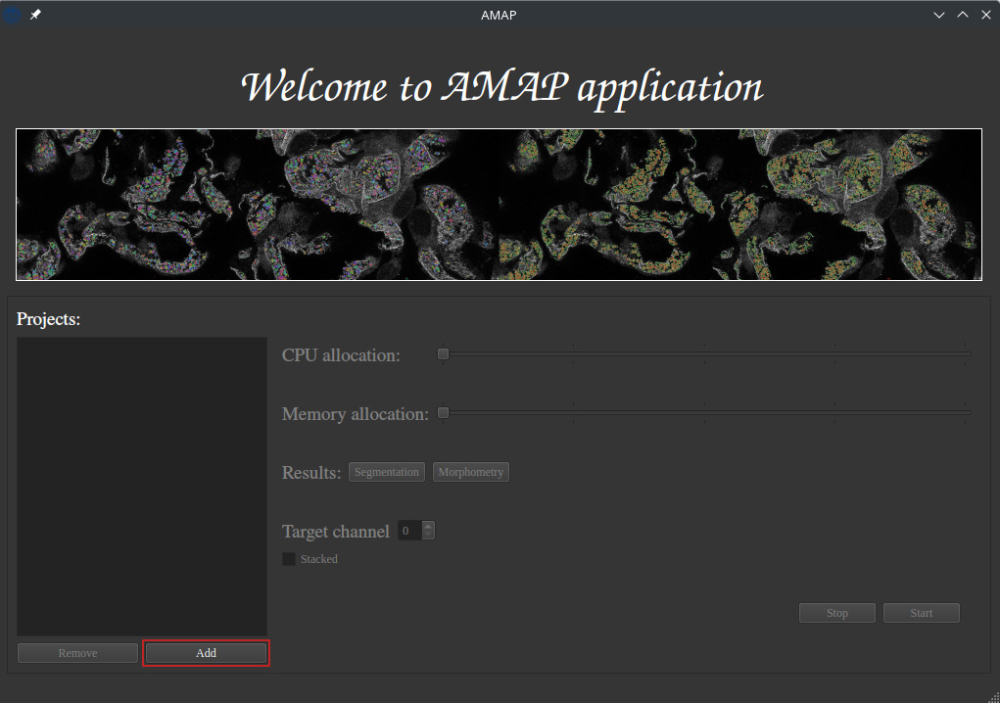
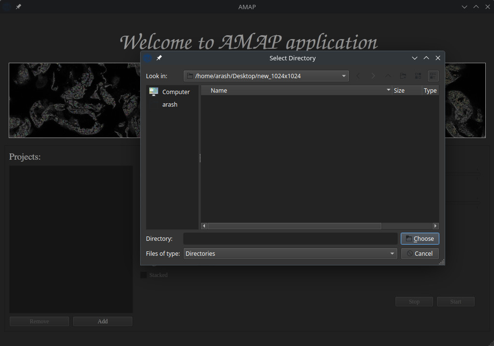
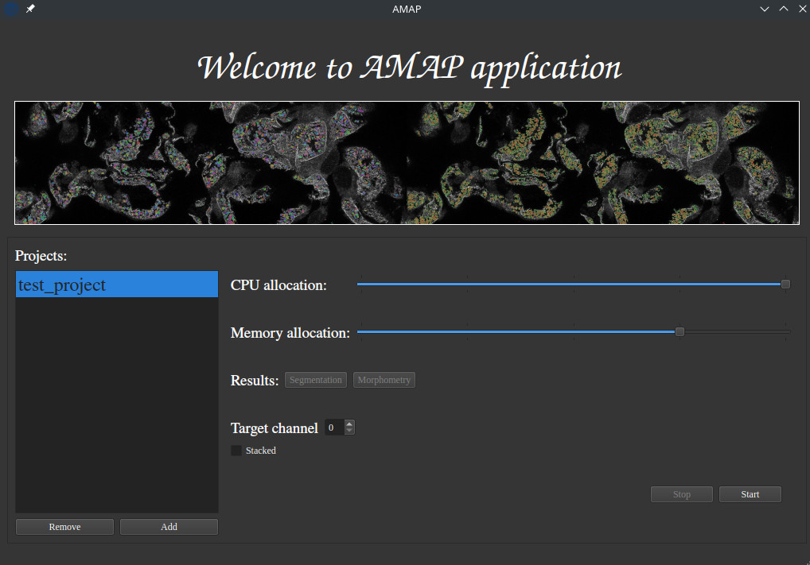
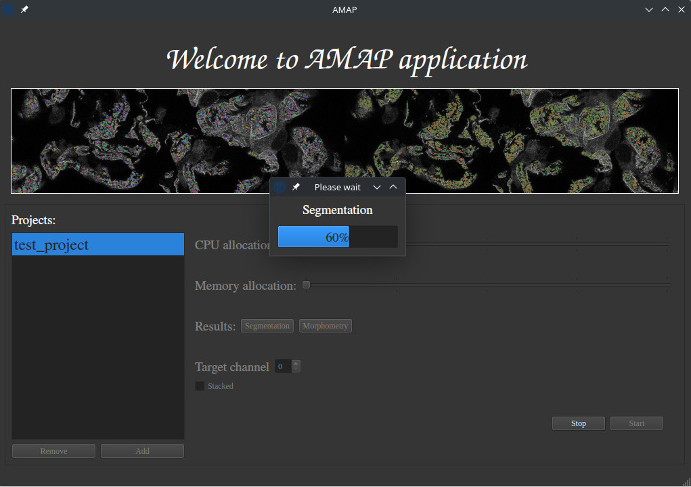
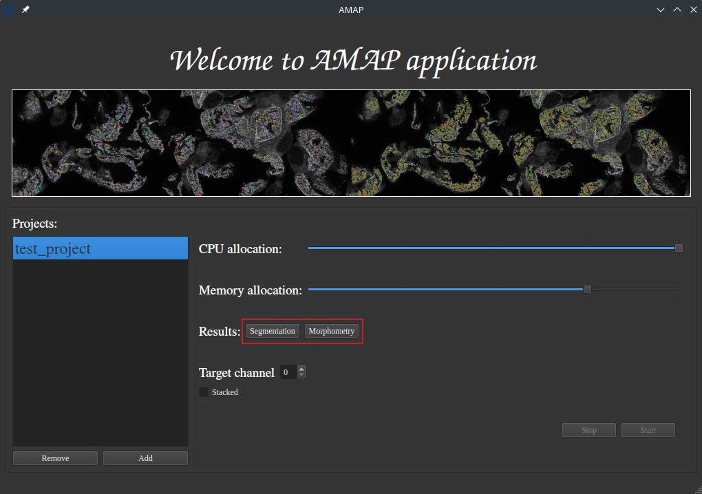

# AMAP Application

AMAP-APP is a desktop application that uses deep learning to perform [segmentation and morphometry quantification of fluorescent microscopy images of podocytes](https://www.kidney-international.org/article/S0085-2538(23)00180-1/fulltext). It runs comfortably on the CPU; a GPU is **optional** and, when available, can accelerate inference (toggled per project).


<!-- IMAGE: top banner / hero image. Existing file res/images/header.png is reused. Replace if you want an updated banner. -->

This application is a reimplementation of the [original research](https://github.com/bozeklab/amap) with modifications to the instance-segmentation algorithm aimed at improving CPU efficiency. Instead of the original pixel-embedding clustering, AMAP-APP derives instances with PyTorch operations and a Connected Component Labeling (CCL) algorithm, achieving comparable results.

AMAP-APP is cross-platform, implemented in Python 3.9, and primarily tested on Linux (with lighter testing on Windows and Mac). Minor visual inconsistencies may appear between platforms but do not affect functionality.

## Requirements

#### Software
The full list is in [requirements.txt](./requirements.txt); the major dependencies are:

* [PySide6](https://pypi.org/project/PySide6/) — Qt bindings for the user interface.
* [PyTorch](https://pytorch.org/) — model inference (and training).
* [tifffile](https://pypi.org/project/tifffile/) — reading TIFF inputs.
* [OpenCV](https://pypi.org/project/opencv-python/), [NumPy](https://numpy.org/), [scikit-image](https://scikit-image.org/) and [SciPy](https://scipy.org/) — image processing and morphometry.
* [pandas](https://pandas.pydata.org/) — assembling the morphometry result tables.

#### Hardware

* **Minimum:** 4 GB RAM, 2 CPU cores.
* **Recommended:** 16 GB RAM, 8 CPU cores.
* **Optional:** a CUDA-capable NVIDIA GPU. Inference uses it automatically when *Use GPU* is enabled and a compatible GPU is detected; otherwise AMAP-APP runs on the CPU.

## Installation

1. Make sure the following are installed:
    * git
    * Python 3.9

2. Clone the repository
```bash
git clone https://github.com/bozeklab/amap-app.git
```

3. Prepare the Python environment

Go into the **amap-app** directory:

```bash
cd amap-app
```

Create a virtual environment:

```bash
python -m venv venv
```

Activate the virtual environment:

* On Linux/Mac

```bash
source ./venv/bin/activate
```

* On Windows

```powershell
Set-ExecutionPolicy Unrestricted -Scope Process
.\venv\Scripts\Activate
```

Install the requirements:

* On Linux/Mac

```bash
pip install -r requirements.txt
```

* On Windows

```powershell
pip install -r requirements-win.txt
```

## Update

To update AMAP to the latest version, open a terminal in the amap-app directory and run:

```bash
git pull
```

## Running AMAP-APP

Activate the virtual environment first, from the repository's directory:

* On Linux/Mac

```bash
source ./venv/bin/activate
```

* On Windows

```powershell
Set-ExecutionPolicy Unrestricted -Scope Process
.\venv\Scripts\Activate
```

Then launch the application:

```bash
python main.py
```

## Using AMAP-APP

AMAP processes images in batches. A **project** is a batch of images plus its configuration. AMAP currently supports **TIFF** files only, and all images in a project should share the same dimensionality. On creation, AMAP inspects the images, reports their rank/shape, and warns if they are inconsistent (it still proceeds, relying on a maximum projection).

### 1. Create a project

* Click **Add**.

<p align="center"></p>
<!-- IMAGE: the project list with the "Add" / "Remove" buttons. Existing file res/images/add_button.jpg reused; update if the layout changed. -->

* Select the directory containing the TIFF files. AMAP copies the images into a new project folder under `projects/<name>/` and stores its settings in `projects/<name>/conf.json`.

<p align="center"></p>
<!-- IMAGE: the OS directory-picker dialog. Existing file res/images/select_project.jpg reused. -->

### 2. Configure the project

Select the project in the list to enable its settings. Settings are split into resource sliders (left) and model/data options (right). Each change is saved to the project's `conf.json` immediately. A small status line at the bottom of the panel summarises the detected input (how many images, their dimensionality and channel count) and what AMAP will do with them — and the **Stacked** / **Target channel** controls enable or disable themselves to match (see below).

<p align="center"></p>
<!-- IMAGE (NEEDS UPDATING): a current screenshot of the configuration panel. The existing res/images/configure_project.jpg is OUT OF DATE — it predates the value labels beneath each slider, the "Data-loader workers" slider, the "Model checkpoint" dropdown, and the "Use GPU" checkbox. Capture a fresh screenshot with a project selected and overwrite res/images/configure_project.jpg. -->

**Resource sliders** — each shows the concrete value it maps to in a small label beneath it:

* **CPU allocation** — Share of logical CPU cores used for inference, in five steps from ~20% up to 100% of the cores. The label shows the percentage and resulting PyTorch thread count (e.g. `80% · 10 threads`).
* **Memory allocation** — Controls the inference batch size; larger batches are faster but use more RAM. The label shows the batch size (e.g. `batch size 24`). ~2 GB of RAM suffices for the lowest setting; 8 GB or more is advised for the highest.
* **Data-loader workers** — Number of background processes that read and prepare image patches in parallel. A value is suggested automatically from the CPU and Memory sliders (and capped at half the logical cores so the loaders don't compete with the inference threads), but you can override it; moving the CPU or Memory slider re-suggests a value. The label shows the worker count (e.g. `6 workers`). `0` loads data in the main process.

**Model and data options:**

* **Model checkpoint** — Selects the trained model weights. AMAP-APP ships with `cp_10940.pth` (default) and an additional checkpoint trained for IgA Nephropathy, `cp_12940.pth`. Any `.pth` file placed in `res/model/` is offered in this list.
* **Stacked** and **Target channel** — These two controls are **enabled only when they apply to your data**, based on the input AMAP detects when you select the project (see the status line described below):
    * **Mixed dimensionality**, or all images **2-D** → both disabled; AMAP handles the input automatically (a 2-D image is used directly; mixed inputs fall back to an automatic maximum projection).
    * All images **3-D** → both enabled. A 3-D input can be either a *z-stack* or a *multi-channel* image, so you choose: tick **Stacked** to maximum-project the stack, or leave it unticked to analyse a single channel chosen with **Target channel**.
    * All images **4-D** → **Stacked** is forced on and locked (a 4-D input is always a multi-channel stack); AMAP maximum-projects the stack and then analyses the channel chosen with **Target channel**.
  When **Target channel** is active, its range is limited to the actual number of channels in your images, and it defaults to `0`.
* **Old ROI algorithm (AMAP)** — Use the original AMAP ROI detection instead of the AMAP-APP method. Leave unchecked for the AMAP-APP algorithm.
* **SD length analysis** — Adds slit-diaphragm (SD) length analysis to the morphometry output. Enabling it shows a confirmation dialog. **Important:** this feature may conflict with a patent filed after the AMAP paper was published. Users are solely responsible for ensuring compliance with all applicable intellectual-property regulations and legal requirements.
* **Use GPU** — When enabled and a CUDA-capable GPU is available, inference runs on the GPU; otherwise it falls back to the CPU. Disable to force CPU execution.
* **Customize…** — Opens a dialog to view and adjust the post-processing and ROI parameters for the project. These were chosen empirically in the AMAP study and are used here as defaults, so you normally do not need to change them; advanced users can tweak them for unusual hardware or samples. The deep-learning model itself is **not** exposed here — to adapt the model, fine-tune it in the [AMAP repository](https://github.com/bozeklab/amap) and load the resulting weights with **Model checkpoint** above. Each parameter shows an inline description in the dialog:
    * **Min foot-process size (px)** — smallest foot process kept; smaller connected components are discarded as noise (default `25`).
    * **ROI contour min area (px)** — smallest ROI outline drawn when outlining the region of interest (default `4000`).
    * **ROI dilation iterations** — morphological dilation steps that merge slit-diaphragm structures into one continuous ROI (default `25`; new ROI algorithm only).
    * **ROI erosion iterations** — morphological erosion steps that tighten/smooth the ROI boundary (default `8`; new ROI algorithm only).
    * **ROI min component area (px)** — smallest connected ROI region kept; smaller regions are removed as noise (default `5000`; new ROI algorithm only).

  Pixel thresholds are measured on images resampled to the fixed 0.0227 µm/px grid, so each pixel value corresponds to a fixed physical size. The ROI-specific parameters are disabled when **Old ROI algorithm** is selected (that algorithm uses its own fixed values); the post-processing parameters stay editable. Changes are saved to the project's `conf.json`, and **Reset to defaults** restores the validated values.

<p align="center"></p>
<!-- IMAGE (TO ADD): the "Customize…" dialog with a project selected, showing the parameter spin boxes and their inline descriptions. Save as res/images/customize_dialog.jpg. -->

### 3. Run the analysis

* Click **Start** and wait for processing to finish. Segmentation runs first, then morphometry; a progress dialog reports the status. Press **Stop** to cancel.

<p align="center"></p>
<!-- IMAGE: the progress dialog during processing. Existing file res/images/progress.jpg reused. -->

### 4. View the results

* Use the **Segmentation** and **Morphometry** buttons to open the output folders.

<p align="center"></p>
<!-- IMAGE: the "Results" row with the Segmentation / Morphometry / Reset buttons, ideally beside an example output. The existing res/images/results.jpg predates the "Reset" button — recapture to include it. -->

### 5. Re-run a project

When a project has finished, its settings are locked. To process it again — for example after selecting a different **Model checkpoint** or adjusting a **Customize…** parameter — click **Reset** in the results row. After a confirmation prompt, this deletes the project's results (the contents of `segmentation/`, `npy/` and `morphometry/`) and re-enables the settings and the **Start** button so the project can be re-run.

<p align="center"></p>
<!-- IMAGE (TO ADD): the "Reset" button in the results row (and/or its confirmation dialog). Save as res/images/reset.jpg. -->

## Outputs

Each project folder under `projects/<name>/` collects the results:

* **`segmentation/`** — per image, four PNG visualizations: `…_instance.png` (instances, randomly coloured), `…_semantic.png` (foot-process / SD classes), `…_roi.png` (region of interest outline), and `…_pred.png` (a side-by-side composite of the three).
* **`npy/`** — per image, a `…_pred.npy` array holding the raw predictions (instance labels and the semantic mask). These are the authoritative segmentation output and the input to morphometry.
* **`morphometry/`** — per image, `…_fp_params.csv` with each foot process's `Label, Area, Perim., Circ.`; `all_params.csv` aggregating per-image means; and, when *SD length analysis* is enabled, `SD_length_grid_index.csv` with the SD-length metrics.

> Note: the instance/composite PNGs use a random colour per instance, so their colours differ between runs even when the segmentation is identical; the `.npy` arrays and CSV values are the reproducible results.
