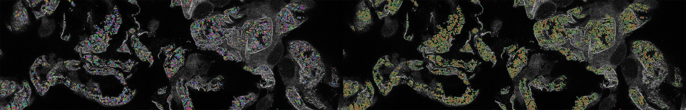

# AMAP Application

AMAP-APP is a desktop application that leverages deep learning to performs [segmentation and morphometry quantification of fluorescent microscopy images of podocytes](https://www.kidney-international.org/article/S0085-2538(23)00180-1/fulltext). The application is tailored for CPU utilization; GPUs are not requisite for its operation.



This application represents a reimplementation of the [original reseasrch](https://github.com/bozeklab/amap) with modifications to the instance segmentation algorithm aimed at enhancing CPU efficiency. A notable departure from the original methodology is observed in the instance segmentation, which no longer depends on pixel embedding clustering. Instead, it capitalizes on PyTorch operations and a Connected Component Labeling algorithm to achieve comparable results.

AMAP-APP is a cross-platform application implemented in Python 3.9, primarily tested on Linux and with less extensive testing on Windows and Mac. While some visual inconsistencies may arise between different platforms, these variations do not compromise the functionality of the application.

## Requirements

#### Software
A full list of required packages is available in [requirements.txt](./requirements.txt), but to name major dependencies:

* AMAP uses [Pyside6](https://pypi.org/project/PySide6/) for its user interface which is a Python wrapper for the Qt framework.
* [Pytorch](https://pytorch.org/) is used for training and inference of the deep learning models.
* [tifffile](https://pypi.org/project/tifffile/) is used to read data samples in tiff format
* [scikit-learn](https://scikit-learn.org/stable/), [OpenCV](https://pypi.org/project/opencv-python/), and [NumPy](https://numpy.org/) are used for various image processing and machine learning tasks.

#### Hardware

Minimum: 4GB of RAM and 2 CPU cores.

Recommended: 16GB of RAM and 8 CPU cores.

## Installation

1. Make sure you have below tools installed
    * git
    * Python 3.9

2. Clone the repository
```bash
git clone https://github.com/platonic-realm/amap-app.git
```

3. Preparing the Python environment

go into the **amap-app** directory

```bash
cd amap-app
```

Create a virtual environment

```bash
python -m venv venv
```
Activate the virtual environment

* On Linux/Mac

```bash
source ./venv/bin/activate
```

* On windows

```powershell
Set-ExecutionPolicy Unrestricted -Scope Process
.\venv\Scripts\Activate
```

Install the requirements

* On Linux/Mac

```bash
pip install -r requirements.txt
```

* On windows

```powershell
pip install -r requirements-win.txt
```

## Update

To update AMAP to the latest version:

* Open a terminal in the amap-app directory

* Run the command:

```bash
git pull
```

## Running AMAP-APP

We need to activate the virtual environment before launching the application. First, using a terminal or PowerShell, go to the repository's directory.

Activate the virtual environment

* On Linux/Mac

```bash
source ./venv/bin/activate
```

* On windows

```powershell
Set-ExecutionPolicy Unrestricted -Scope Process
.\venv\Scripts\Activate
```

Execute the application

```bash
python main.py
```

## Using AMAP-APP

AMAP application processes images in batches. A project is a batch of images combined with certain configurations. All images in a project must have the same order of dimensionality. At the current state AMAP only supports tiff files, therefore to create a project:

* Click on the "Add Project" button

<p align="center">  </p>

* Select the directory containing the tiff files

<p align="center">  </p>

* Configure the project

	* CPU Allocation: Specifies the core count utilized by the application, with a minimum of 1 and a maximum corresponding to the available number of cores.
	* Memory Allocation: Sets the batch size during inference. A minimum of 2GB of memory is recommended for lower settings, while atleast 8GB is advised for optimal performance at maximum settings.
	* Target Channel: AMAP-APP endeavors to autonomously detect the target channel in the input images. Adjust this value only in cases where the automatic detection proves inaccurate.
	* Stacked Checkbox: Specifies whether the input images are an array of stacked images. If affirmative, AMAP will employ a max projection of the stack. Modify this value if the detection is inaccurate.

<p align="center">  </p>

* Click the **Start** button and await the completion of the processing

<p align="center">  </p>

* Open Segmentation and Morphometry directories using the related buttons.

<p align="center">  </p>
